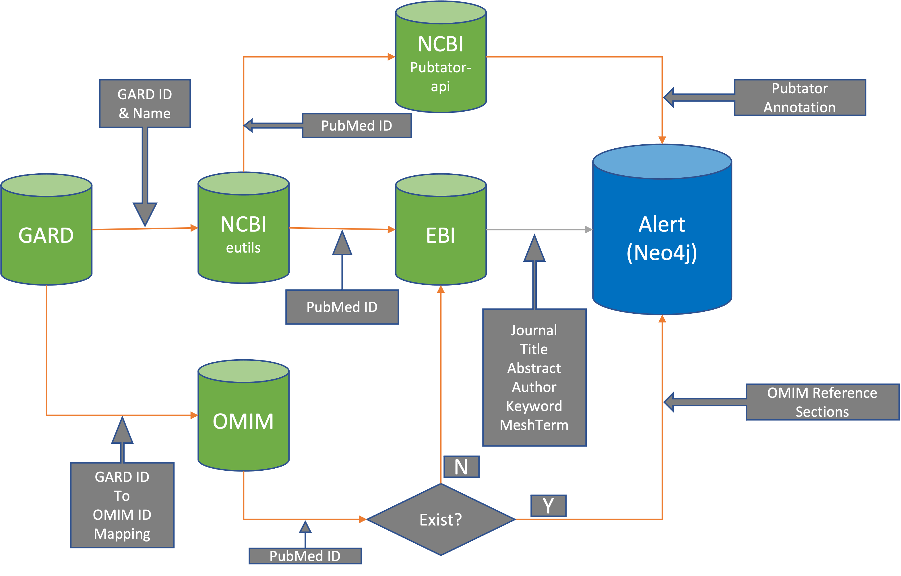

# Introduction
One of the target of the alert project is to load all PubMed articles related to rare diseases to a knowledge graph database - Neo4j. Here we use `Python` and third party `API` to parse and load all the information on-the-fly to Neo4j database.

# Architecture
## Data Source
The following data sources are used to build this Neo4j database:
- GARD data lake.
- NCBI.
  - NCBI eutils
  - NCBI Pubtator
- EBI
- OMIM

Rare diseases related information such as GARD_ID and Name are returned by cypher query against GARD data lake Neo4j database. Disease name is used to query NCBI PubMed archieve to get a list of PubMed article IDs. Because of the large number of articles for same diseases, we limit the number of articles for each disease to 1000.

EBI, instead of NCBI PubMed archieve and `APIs` are used to get the article informaiton, such as title, keywords, abstract, etc. because of the following reseans:
1. NCBI has limitation on how many `API` calls can make in one second (around 3 per second).
2. EBI does not have such limit and it also provids an `API` that can query/return as much as 1000 PubMed articles.

Pubtator `API` is used to get further annotations such as MESH term and Gene for an article. There is also a limit (3 calls per second) for how often the `API` can be called. The loading program force itself to sleep for a while (0.34 second) between the calls.

OMIM `APIs` are used to get all the OMIM reference PubMed articles for rare diseases. These articles are then checked against what have loaded into the Neo4j, and the missing ones are loaded using the same procedure.

## Data Flow

# Neo4j Data Model

